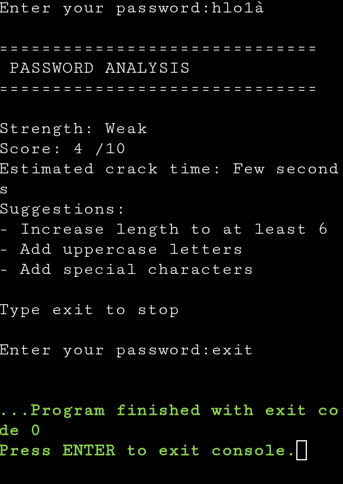

# 🔐 Smart Password Strength Analyzer

A Python-based tool that analyzes password strength and provides real-time feedback with suggestions to improve security.

---

## 🚀 Features
- Evaluates password based on:
  - Length
  - Uppercase letters
  - Lowercase letters
  - Numbers
  - Special characters  
- Provides:
  - Strength level (Weak / Moderate / Strong)
  - Score out of 10
  - Estimated crack time
---

## 🛠️ Tech Stack
- Python

---

## 📸 Sample Output

---

## ▶️ How to Run

1. Install Python  
2. Download or clone this repository  
3. Run the file:

python password_checker.py

---

## 🎯 Future Improvements
- Convert into a web application  
- Add AI-based password suggestions   

---

## 💡 About
This project was built as part of my learning journey in Python and Cybersecurity. It demonstrates how basic programming concepts can be used to solve real-world security problems.
